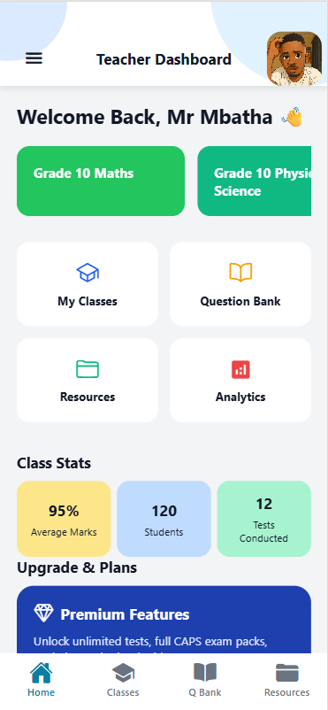
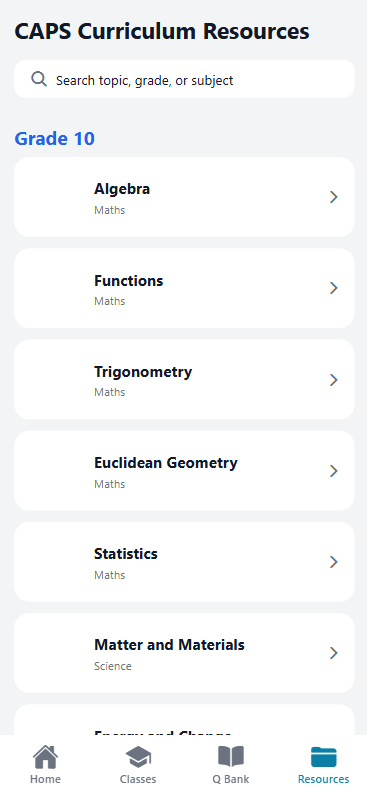
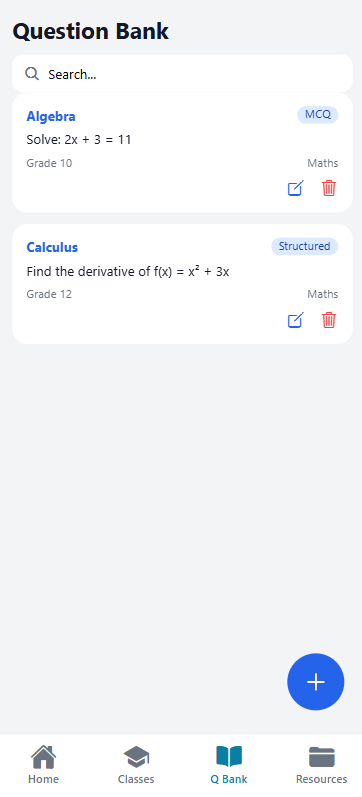
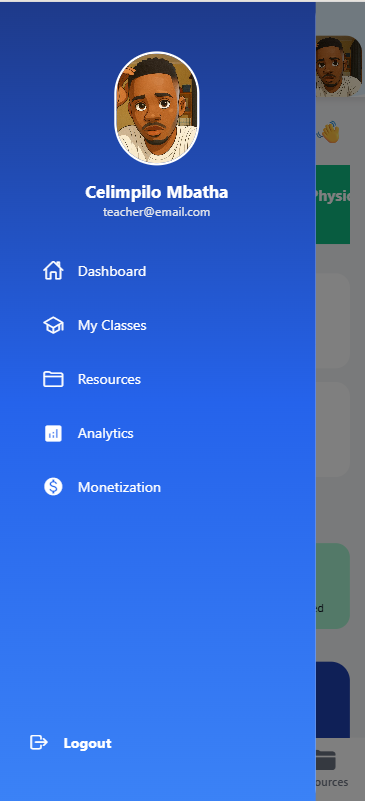
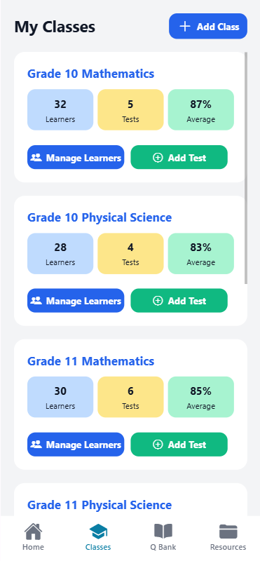

# EduConnect

**EduConnect** is a React Native app built with Expo, designed for teachers to manage their classrooms efficiently. The app provides features like class management, resources, question banks, analytics, and monetization options.

## Features

- **Dashboard** – Overview of classes and stats.
- **Class Management** – Add, edit, and view students and grades.
- **Resources** – CAPS curriculum resources organized by grade and subject.
- **Question Bank** – Add, edit, delete, preview, and select questions for tests.
- **Analytics** – Track student performance and class statistics.
- **Monetization Options** – Free version, subscriptions, school-wide licenses, premium packs, and optional advertising.
- **Custom Drawer Navigation** – Profile, logout, and screen navigation with gradient background.

## Screenshots








## Tech Stack

- **React Native** + Expo
- **TypeScript**
- **Expo Router**
- **Firebase** (Auth, Realtime DB)
- **Supabase** (File storage)
- **Expo Linear Gradient**
- **Vector Icons (Ionicons, MaterialIcons)**

## Installation

1. Clone the repository:

```bash
git clone https://github.com/yourusername/educonnect.git
cd educonnect